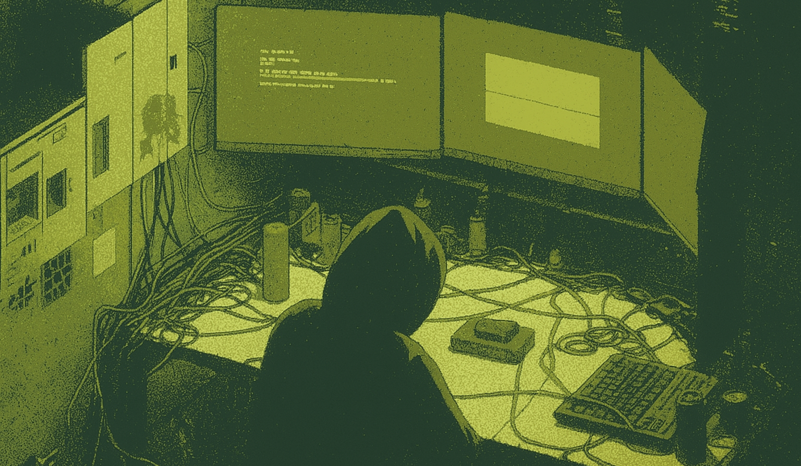

<h1 align="center"> ¡Hola! Soy Facundo Vera 👨‍💻</h1>

  

## 🧠 Sobre mí

Actualmente estoy estudiando Desarrollo Web en RollingCode School.
Me encuentro en un proceso continuo de aprendizaje, fortaleciendo mis habilidades en HTML, CSS, Bootstrap, Git y GitHub para el control de versiones y el trabajo colaborativo. También estoy comenzando a explorar JavaScript para seguir creciendo como desarrollador web.

## 🧪 Tecnologías

  
  
  
  

## 🚀 Proyectos destacados

---

### 🟢 **DevBox**
🔗 [Ver repositorio](https://github.com/Facundo-Vera/DevBox)

**DevBox** es una plataforma que recopila **recursos gratuitos útiles para programadores**, diseñada para facilitar el acceso a herramientas, documentación y materiales de aprendizaje de forma simple y organizada.  

#### 🧰 Tecnologías utilizadas
- HTML5  
- CSS3  
- JavaScript  
- Bootstrap 
- Git & GitHub  

#### 💡 Características principales
- Repositorio de recursos gratuitos  
- Diseño moderno y responsivo  
- Navegación intuitiva  
- Modo oscuro y claro  

---

### 🎬 **E-Film**
🔗 [Ver repositorio](https://github.com/celestemariel28/e-film)

**E-Film** es una plataforma web para ver películas y series, diseñada para ser accesible desde cualquier dispositivo con una interfaz simple y responsiva.  

El proyecto fue realizado en equipo, donde **colaboré con el desarrollo del frontend**, aportando en la estructura visual y la experiencia de usuario.

#### 🧰 Tecnologías utilizadas
- HTML5  
- CSS3  
- Bootstrap 
- Git & GitHub  

#### 💡 Características principales
- Interfaz moderna y responsive  
- Navegación intuitiva  
- Catálogo de películas y series  

#### 👥 Trabajo en equipo
Este proyecto me permitió fortalecer habilidades de **trabajo colaborativo**, **control de versiones con Git** y **desarrollo frontend en equipo**.

## 📊 Mis estadísticas

  
   
   
  

## 📬 Contacto
📧 facundovera.dev@gmail.com  
📫 Conectemos en [LinkedIn](https://www.linkedin.com/in/facundo-vera-175101378/)

